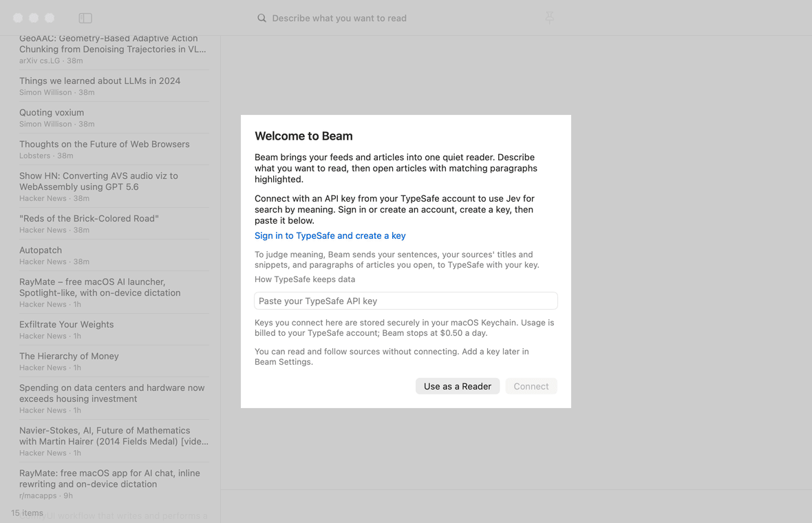

# Beam

**Find what you want to read. See the relevant passages.**

Beam is a native macOS feed reader powered by [TypeSafe's Jev](https://typesafe.ai).
Describe a topic in one sentence to rank your sources by meaning, then open an article to see its matching
paragraphs. Your reading library stays on your Mac.

[](https://github.com/bentrd/Beam/releases/download/v0.1.0/Beam-demo.mp4)

[Watch the short showcase video](https://github.com/bentrd/Beam/releases/download/v0.1.0/Beam-demo.mp4).
Recorded with sample feeds and live Jev judgments. Includes `⌘F` Find by Meaning, match navigation,
pinned searches and highlight colors.

## Install

Requires **macOS 26 or later**. The universal download supports Apple silicon and Intel Macs.

1. Download the ZIP from [Releases](https://github.com/bentrd/Beam/releases/latest).
2. Unzip it and drag **Beam.app** into Applications.
3. Open Beam and connect your TypeSafe account, or choose to continue as a plain reader.

This early release is ad-hoc signed, without Apple notarization. If macOS blocks the download, attempt to
open it once, then allow Beam in **System Settings → Privacy & Security → Open Anyway**.
You can also build it locally using the instructions below.

## Connect TypeSafe

On first launch, Beam walks you through connecting Jev. Open the
[TypeSafe API keys page](https://console.typesafe.ai/keys), sign in or create an account, create an API key,
then paste it into Beam's secure field and choose **Connect**. Beam validates the key before saving it in
your macOS login Keychain. You can replace the key or disconnect from **Beam → Settings** (`⌘,`).

You can read feeds without a key. Searching and finding passages by meaning use your own TypeSafe account
and its available credits. Beam estimates usage and stops new requests at approximately $0.50 per local day.

To judge meaning, Beam sends your search sentences, feed titles and snippets, and paragraphs of articles
you open to TypeSafe. It validates a new key using fixed sample text. Optional checking of the top three
results before you open them is off by default. See [TypeSafe's data policy](https://typesafe.ai/legal/privacy-policy).
Your feeds, articles, pins and read state are stored in `~/Library/Application Support/Beam/beam.sqlite`.

## Read and search

Beam starts with Hacker News, MLX releases and Apple Machine Learning Research. Remove any source or add
your own RSS/Atom feed, site, subreddit, arXiv topic, GitHub releases or YouTube channel.

| Action | Shortcut |
|---|---|
| Search your sources | Type a sentence, then Return |
| Focus search | `⌘L` |
| Open the selected result | Return |
| Add a source | `⌘N` |
| Refresh sources | `⌘R` |
| Find passages by meaning in an article | `⌘F` |
| Next / previous matching passage | `⌘G` / `⇧⌘G` |
| Pin / unpin a search | `⌘D` |
| Settings | `⌘,` |

Pin useful searches to revisit them as new items arrive. Failed or pending checks stay visibly distinct
from negative matches. Broad topics can match most of an article; Beam then invites you to find something
narrower. Articles are shown as text, with **Open Original** for images, tables or pages it cannot extract.

Choose Yellow, Green, Blue, Purple or Pink highlights in **Beam → Settings → Appearance**. The choice
is saved and updates article highlights and list match marks immediately in light and dark mode.

## Build and verify

Requires Swift 6.2 or later and a macOS 26 SDK, available in compatible Xcode or Command Line Tools.
There are no third-party package dependencies.

```sh
tooling/check.sh                     # build and run all offline checks
tooling/make-app.sh                  # release build for this Mac → build/Beam.app
open build/Beam.app
tooling/make-release.sh              # verified universal app + ZIP + SHA-256 checksum
```

`VERSION` supplies the app and archive version. Packaging stops on build, resource or signing failures.
GitHub Actions runs the same offline suite and packages the universal app on macOS 26.

For live feed checks, run `.build/debug/check-feeds` or `.build/debug/beam-eval all`.
Live Jev checks use `BEAM_KEY` or `TYPESAFE_API_KEY` from the environment; keep credentials out of source control.
Debug app builds accept these variables too. Distributed release builds use the Keychain connection flow.

For design review, run `open build/Beam.app --args -fake YES -look light` (or `dark`).
Captured data needs no network, key or database, and does not show onboarding.

## Project layout

| Path | Purpose |
|---|---|
| `Sources/BeamUI` | SwiftUI shell and AppKit reader |
| `Sources/BeamEngine` | Sources, search, reader and account coordination |
| `Sources/BeamJev` | TypeSafe client, Keychain and usage limits |
| `Sources/BeamStore` | SQLite library and judgment cache |
| `Sources/BeamFeeds`, `Sources/BeamExtract` | Feed discovery and article extraction |
| `Sources/check-*`, `Sources/beam-eval` | Checks and acceptance suite |
| `docs/` | Product, design, architecture and development evidence |
| `mock/`, `spikes/` | Original design mock and experiments |
